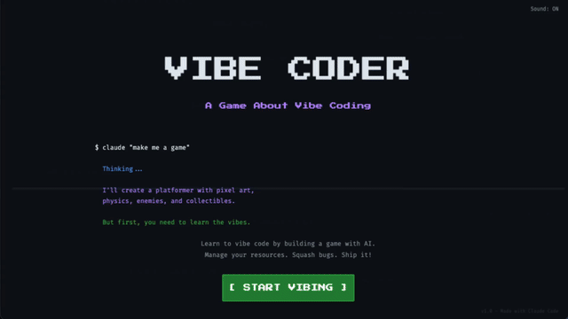

    

<h1 align="center">Naval</h1>

  

<h2 align="center">Compétences</h2>

<h3 align="center">Langages</h3>

  

<h3 align="center">Frontend</h3>

  

<h3 align="center">Backend</h3>

  

<h3 align="center">Bases de données</h3>

  

<h3 align="center">Outils</h3>

  

<h2 align="center">Contact</h2>

  
  
  

